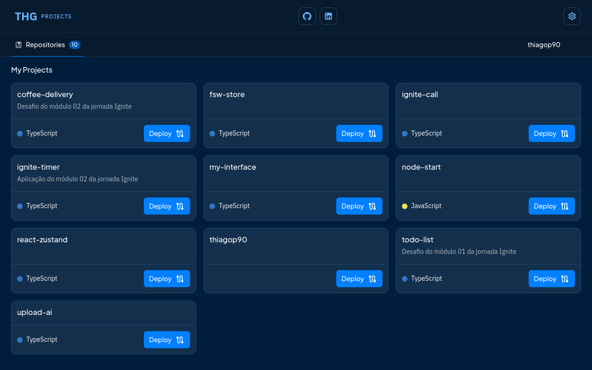

<h1>
  My Interface
</h1>

Este projeto é um front-end que utiliza a API do GitHub para exibir e gerenciar todos os meus repositórios públicos. O design foi inspirado no [MUI](https://mui.com/).

## Características

Este front-end apresenta as ferramentas e práticas mais recentes em desenvolvimento web!

- ⚛️ React — Uma biblioteca para construir interfaces de usuário.
- ⚡ Vite — Ferramenta de construção que oferece uma experiência de desenvolvimento mais rápida.
- 💅 CSS — Utilização de Styled Components para estilização.
- Ⓜ️ Material Icons - Integração de um pacote de ícones.
- 💖 Lint — Configuração com ESlint, Prettier e Editor Config.

## Projeto 

Neste projeto, foi desenvolvida uma aplicação responsiva com uma API REST para gerenciar meus repositórios no GitHub. As principais funcionalidades incluem:

- Link para visualizar mais informações do repositório no GitHub.
- Descrição do repositório.
- Linguagem de programação do repositório.
- Botão para visitar o projeto online (deploy).
- Opção para alterar entre os temas light e dark.

Data de conclusão do projeto: 27/05/2023
